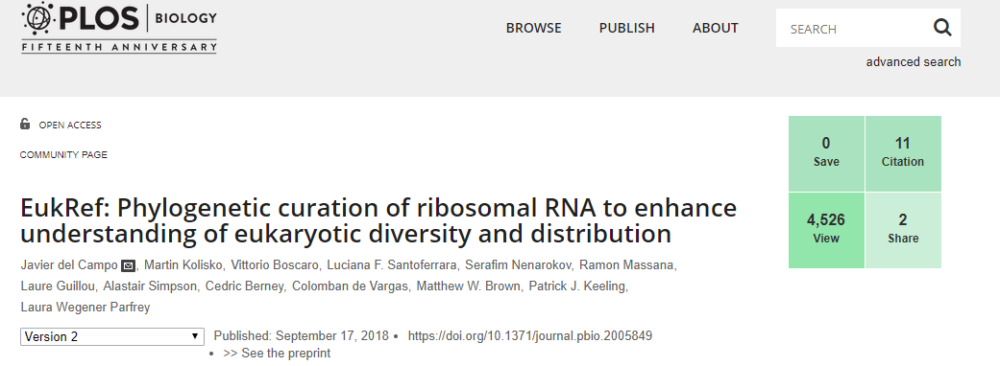

del Campo J., Kolisko M., Boscaro V., Santoferrara LF., Nenarokov S., Massana R., Guillou L., Simpson A., Berney C., de Vargas C., Brown MW., Keeling PJ., Wegener Parfrey L. 2018. [EukRef: Phylogenetic curation of ribosomal RNA to enhance understanding of eukaryotic diversity and distribution](https://journals.plos.org/plosbiology/article?id=10.1371/journal.pbio.2005849). PLOS Biology 16:e2005849. DOI: 10.1371/journal.pbio.2005849.

```{r, echo=FALSE, message=FALSE, warning=FALSE, results="asis"}
library(dplyr)
library(stringr)
library(RefManageR)

# 
# See: https://ropensci.org/blog/2020/05/07/rmd-citations/
bib <- ReadBib("eukref_2022.bib")
BibOptions(check.entries = FALSE, style = "markdown", bib.style = "authoryear", no.print.fields = c("pmid", "url"))

cat("### Number of papers citing EukRef: ", length(bib), '\n\n')

for(year in 2022:2018){
cat(str_c("\n", "## ", year, "\n"))
  
bib_year = bib[year = as.character(year)]
  
NoCite(bib_year)
  
PrintBibliography(bib_year)
}
```
